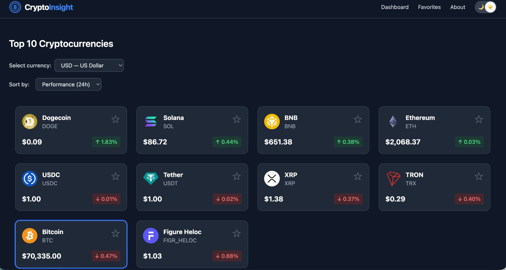

# CryptoInsight

> Real-time cryptocurrency market data dashboard with educational focus.

Built by **Alden Merlin** as an open-source portfolio project demonstrating modern full-stack engineering practices.

🌐 **Live:** [crypto-insight.aldenmerlin.com](https://crypto-insight.aldenmerlin.com)

📘 **API Docs:** [crypto-insight.aldenmerlin.com/docs](https://crypto-insight.aldenmerlin.com/docs)

---



---

## What it is

CryptoInsight is a web platform that visualizes live cryptocurrency market data and helps beginners understand the crypto ecosystem through an educational landing page, clean charts, real numbers, and straightforward information.

**It is not** a crypto exchange, wallet, trading platform, or financial advisory service.

---

## Features

- **Educational landing page** — Core concepts, glossary, FAQ and risk disclaimer for beginners
- **Live market data** — Top 10 cryptocurrencies by market cap, updated on every load
- **7-day price chart** — Interactive line chart for the selected coin
- **Multi-currency support** — USD, EUR and BRL
- **Favorites** — Save coins to a personal list (requires local storage consent)
- **Sort & filter** — Sort by performance, price or name
- **Dark / light theme** — Persisted across sessions, logo and UI fully adaptive
- **Responsive** — Works on mobile, tablet and desktop
- **Internationalization** — EN and PT-BR support via i18next
- **Contract-First API** — OpenAPI 3.1 spec with interactive Scalar documentation
- **API resilience** — Backend-first with automatic CoinGecko direct fallback

---

## Tech stack

| Layer | Technology |
|---|---|
| **Frontend** | |
| UI | React 19 + TypeScript |
| Build | Vite |
| Styling | Tailwind CSS (dark mode via class strategy) |
| State | Zustand (with persist middleware) |
| Routing | TanStack Router |
| Charts | Recharts |
| HTTP | Axios |
| i18n | i18next + react-i18next |
| **Backend** | |
| Framework | Fastify 5 |
| API Spec | OpenAPI 3.1 via @fastify/swagger |
| API Docs UI | Scalar API Reference |
| Cache | In-memory TTL (60s coins, 120s history, 5min detail) |
| **Shared** | |
| Types | Canonical TypeScript types consumed by both layers |
| **Infrastructure** | |
| Testing | Vitest + Testing Library |
| Linting | ESLint + typescript-eslint |
| Deploy | Vercel (static frontend + serverless API) |
| Commits | Commitlint + Husky |

---

## Data source

All market data is fetched from the [CoinGecko public API](https://www.coingecko.com/en/api) (free tier). No API key required.

The backend proxies CoinGecko requests with an in-memory TTL cache, reducing the number of calls to stay within the free tier rate limit (~30 req/min). If the backend is unavailable for any reason, the frontend falls back to calling CoinGecko directly from the browser — the same behavior as v1.

---

## Architecture

```
crypto-insight/
├── shared/                    # Canonical types (single source of truth)
│   └── types.ts               # Coin, PricePoint, CoinDetail, ApiError
│
├── server/                    # Backend (Fastify)
│   └── src/
│       ├── app.ts             # Fastify app builder (shared by dev + serverless)
│       ├── server.ts          # Dev entry point (localhost:3001)
│       ├── plugins/
│       │   └── swagger.ts     # OpenAPI spec generation + Scalar UI at /docs
│       ├── schemas/           # JSON Schema contracts (feeds validation + spec)
│       │   ├── health.ts
│       │   └── coin.ts
│       ├── services/
│       │   └── coingecko.ts   # CoinGecko proxy with in-memory TTL cache
│       └── routes/
│           ├── health.ts      # GET /api/health
│           ├── coins.ts       # GET /api/coins, GET /api/coins/:id
│           └── charts.ts      # GET /api/coins/:id/history
│
├── api/                       # Vercel Serverless Function
│   └── [...path].ts           # Catch-all handler (self-contained)
│
├── src/                       # Frontend (React)
│   ├── components/            # Reusable UI components
│   │   └── ui/                # Primitive elements (Logo, skeleton, theme toggle)
│   ├── pages/                 # Route-level page components
│   │   ├── Landing.tsx        # Educational entry point (/)
│   │   ├── Home.tsx           # Live dashboard (/dashboard)
│   │   ├── Favorites.tsx      # Saved coins (/favorites)
│   │   └── About.tsx          # Project info (/about)
│   ├── routes/                # TanStack Router config
│   ├── services/              # API client (backend-first + CoinGecko fallback)
│   ├── store/                 # Zustand stores (crypto, theme, language)
│   └── utils/                 # Pure utility functions
│
├── vite.config.ts             # Dev proxy: /api → localhost:3001
└── vercel.json                # Rewrites: /api/*, /docs/* → serverless function
```

**Key architectural decisions:**

- `shared/types.ts` is the single source of truth for TypeScript types — both frontend and backend import from here
- Backend follows **Contract-First** design: JSON Schemas define the API contract, which feeds both Fastify request validation and OpenAPI spec generation
- `cryptoStore` is the single source of truth for all market data in the frontend — no parallel fetching
- Business logic stays in `services/` and `store/` — UI components are dumb consumers
- Frontend uses a **backend-first with fallback** strategy: tries `/api/*` first, falls back to CoinGecko direct if the backend is unavailable
- `persist` middleware in Zustand handles localStorage — no manual storage utilities needed
- Router root route owns the `ConsentBanner` — renders on all pages without prop drilling

---

## API endpoints

| Method | Endpoint | Description |
|---|---|---|
| `GET` | `/api/health` | Server status, timestamp and version |
| `GET` | `/api/coins?currency=usd` | Top 10 cryptos by market cap |
| `GET` | `/api/coins/:id` | Educational detail for a coin |
| `GET` | `/api/coins/:id/history?currency=usd&days=7` | Price history for charts |
| `GET` | `/docs` | Interactive API Reference (Scalar) |
| `GET` | `/docs/json` | Raw OpenAPI 3.1 spec |

---

## Local setup

### Prerequisites

- Node.js 20+
- npm 10+

### 1. Clone and install

```bash
git clone https://github.com/merlinfachetti/crypto-insight.git
cd crypto-insight

# Install frontend dependencies
npm install

# Install backend dependencies
cd server && npm install && cd ..
```

### 2. Run the backend

```bash
cd server
npm run dev
```

The backend starts at **http://localhost:3001**. You should see:

- **Health check:** http://localhost:3001/api/health
- **Coins data:** http://localhost:3001/api/coins
- **Interactive API Reference:** http://localhost:3001/docs

### 3. Run the frontend (in a separate terminal)

```bash
# From the project root
npm run dev
```

The frontend starts at **http://localhost:5173**. Vite automatically proxies `/api/*` requests to the backend at `localhost:3001`.

### 4. Run tests

```bash
# From the project root
npm run test
```

### 5. Build for production

```bash
npm run build
```

> **Note:** The frontend works even without the backend running — it automatically falls back to calling CoinGecko directly. The backend adds caching and the interactive API docs.

---

## Scripts

### Frontend (project root)

| Command | Description |
|---|---|
| `npm run dev` | Start Vite dev server (port 5173) |
| `npm run build` | TypeScript check + production build |
| `npm run preview` | Preview production build locally |
| `npm run lint` | Run ESLint |
| `npm run test` | Run all tests (Vitest, 12 tests) |
| `npm run test:watch` | Watch mode |

### Backend (`server/`)

| Command | Description |
|---|---|
| `npm run dev` | Start Fastify with hot reload (port 3001) |
| `npm run build` | Compile TypeScript to `dist/` |
| `npm run start` | Run compiled server from `dist/` |

---

## API resilience strategy

The frontend uses a two-tier data fetching strategy to ensure the app always works:

```
Request flow:

  1. Try backend (/api/coins) → 8s timeout
     ├── Success → return data (cached, fast)
     └── Failure → silent, continue to step 2

  2. Try CoinGecko direct (browser → api.coingecko.com)
     ├── Success → return data (same as v1 behavior)
     └── Failure → show error to user
```

This means the app is resilient to backend cold starts, serverless function failures, Vercel outages, or deployment issues. Data always loads.

---

## Deploy

### Production (automatic)

Every push to `main` triggers an automatic deploy via Vercel Git Integration:

1. Vercel installs dependencies and builds the Vite frontend
2. The `api/[...path].ts` serverless function is bundled automatically
3. Rewrites route `/api/*` and `/docs/*` to the serverless function
4. Everything else serves the SPA from `dist/`

**Live URL:** [crypto-insight.aldenmerlin.com](https://crypto-insight.aldenmerlin.com)

### Manual deploy

```bash
npx vercel --prod
```

**Required secret:**

| Secret | Description |
|---|---|
| `VERCEL_TOKEN` | Personal Access Token from vercel.com/account/tokens |

---

## Privacy

CryptoInsight stores three things in your browser's local storage:

- Your favorited coins
- Your selected currency
- Your theme preference

No personal data is collected. No analytics. Nothing is sent to any server other than CoinGecko for market data. Consent can be revoked at any time from the dashboard.

---

## License

MIT © [Alden Merlin](https://github.com/merlinfachetti)
